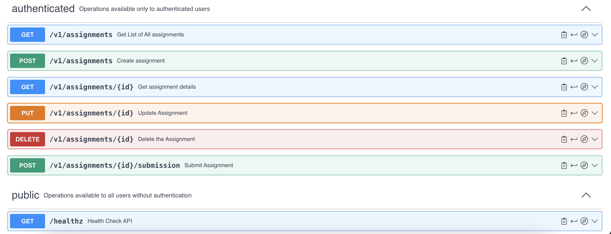

# Assignment Sravani Banala Network Structures and Cloud computing


## Goal
This repository contains the source code for a cloud-native backend web application developed with the Node.js runtime environment, utilizing frameworks like Express.js for routing and middleware, and Sequelize as an ORM to interact with SQL databases in a structured and promise-based manner. The application was built iteratively as part of the coursework for CSYE-6225, **Network Structures and Cloud Computing**.

The OpenAPI specification for the application's endpoints is hosted here: [https://app.swaggerhub.com/apis/SRAVANIBVL99/CSYE6225-WebApp/)

## AWS Architecture
Typically application flow comprises of the following steps:

1. User submits an assessment via the the POST method  to **/v1/assignments/{id}/submission**. Here's a sample payload :
   ```JSON
   {
   "submission_url":  "https://github.com/tparikh/myrepo/archive/refs/tags/v1.0.0.zip"
   }
   ```
2. Upon passing validations, the application leverages AWS SNS SDK to publish a message to an SNS topic. The message has the following format:
```JSON
{
    "email": "user@example.com",
    "attempt": 1,
    "id": "ba45b5e2-5e5c-448f-8881-01ab357c4c67",
    "submissionID": "81568826-4609-437c-a4cc-5ae3fe6ab94a",
    "url": "https://github.com/tparikh/myrepo/archive/refs/tags/v1.0.0.zip",
    "status": "SUCCESS",
    "message": "",
    "timestamp": "2023-12-05T22:22:27.713015948Z"
}
```
3. The publication of a message to the topic triggers a lambda function, which then deserialized the JSON payload and performs the following actions
  - Downloads the submission ZIP from the endpoint provided by the user
  - Uploads the ZIP to a GCP Cloud Storage bucket
  - Creates a new item for the submission in a DynamoDB table
  - Leverages SMTP to send an email to the user about the submissions status and its storage details

Here is a brief overview of the AWS components by their functionality involved in driving the use cases of the application:

### DNS & Traffic encryption
---


| **AWS Service/Component**     | **Description**                                                                                                                                                 |
|-------------------------------|-----------------------------------------------------------------------------------------------------------------------------------------------------------------|
| Route53                       | Hosted zone for the custom domain houses A, NS, SOA, TXT and CNAME type DNS records for routing traffic to load balancer and authorizating mailgun email server |
| AWS Certificate Manager (ACM) | Holds the SSL certification that was acquired, enabling HTTPS communication betweeen users and the load balancer                                                |

### Compute & Storage
---

| **AWS Service/Component** | **Description**                                                                                               |
|---------------------------|---------------------------------------------------------------------------------------------------------------|
| EC2                       | The web application runs of t2.micro instances with a custom AMI backed by debian-12-amd64 linux distribution |
| EBS                       | 25 GiB block volume attached to EC2 instances                                                                 |
| Application Load Balancer | Listens for traffic on port 443 and forwards it to a target group of our web application on port 80           |
| AutoScaling Group         | Configured with minimum: 1, maximum: 3 and desired: 2 instances and a launch template with the custom AMI     |

### Databases
---


| **AWS Service/Component** | **Description**                                                                                                       |
|---------------------------|-----------------------------------------------------------------------------------------------------------------------|
| RDS                       | db.t3.micro backed MariaDB instance with 20GiB storage, 1GB RAM hosted in a Multi-AZ deployment for high availability |

### Networking and Security
---

| **AWS Component/Service** | **Description**                                                                                                                                                                                                                                                                                                                                                 |
|---------------------------|-----------------------------------------------------------------------------------------------------------------------------------------------------------------------------------------------------------------------------------------------------------------------------------------------------------------------------------------------------------------|
| EC2                       | The web application runs of t2.micro instances with a custom  AMI backed by debian-12-amd64 linux distribution                                                                                                                                                                                                                                                  |
| EBS                       | 25 GiB block volume attached to EC2 instances                                                                                                                                                                                                                                                                                                                   |
| Route53                   | Contains a Hosted Zone that houses A, SOA, NS and CNAME records for custom domain and email server                                                                                                                                                                                                                                                              |
| VPC                       | VPC house all the infra components under one roof, thus ensuring isolation from other services in the same account                                                                                                                                                                                                                                              |
| Security Groups           | There are 3 primary security groups:  1. LoadBalancer SG: ensures that only HTTPS traffic is let through on port 443 and outbound traffic only reaches Application SG 2. Application SG: allows inbound traffic from LoadBalancer SG only and outbound traffic to Database SG on port 3306 3. Database SG: allows traffic on port 3306 from Application SG only |

### Serverless Components
---

| **AWS Service/Component**              | **Description**                                                                                                                                                                                                                                                                                                                                                   |
|----------------------------------------|-------------------------------------------------------------------------------------------------------------------------------------------------------------------------------------------------------------------------------------------------------------------------------------------------------------------------------------------------------------------|
| Simple Notification Service(SNS) topic | Standard topic that gets messages from the web application when users hits the /submission endpoint                                                                                                                                                                                                                                                               |
| Lambda                                 | Lambda gets triggered by the SNS topics and performs the following operations in order: 1. Downloads the submission ZIP from the endpoint provided by the user 2. Invokes GCP APIs to store the ZIP in Cloud Storage bucket 3. Records submission details as an item in DynamoDB table 4. Sends an email to the user via SMTP about submission status and details |
| DynamoDB                               | NoSQL table for storing submission details in the web application execution flow                                                                                                                                                                                                                                                                                  |

### Identity and Access Management
---

| **AWS Service/Component** | **Description**                                                                                          |
|---------------------------|----------------------------------------------------------------------------------------------------------|
| IAM - DynamoDB policy     | RBAC policy that enables the lambda runtime to create items in dynamoDB table                            |
| IAM - Cloudwatch Role     | role attached to web application EC2 instances that enable them to export logs and metrics to cloudwatch |
| IAM - SNS role            | role attached to web application EC2 instances to authorize SDKs to publish to SNS topic                 |
| IAM - Github user         | enables GitHub workflow to perform EC2 instance refresh as part of CI/CD                                 |

### Observability
---

| **AWS Service/Component**   | **Description**                                                                                                                      |
|-----------------------------|--------------------------------------------------------------------------------------------------------------------------------------|
| Cloudwatch scale-up alarm   | Works with autoscaler to ensure that EC2 instances scale up when avg CPU utilization across all instances exceeds set threshold      |
| Cloudwatch scale-down alarm | Works with autoscaler to ensure that EC2 instances scale down when avg CPU utilization across all instances goes below set threshold |
| Cloudwatch metrics and logs | Web application logs and metrics are exported to cloudwatch for more insights and observability                                      |


## UML Diagram and Endpoints

The application comprises of these REST-based endpoints spanning across 2 controllers:



## CI/CD & Test Suite

To deploy the web application in a consistent, repeatable and reliable manner, we leverage automation and adopt DevOps best practices. **HashiCorp Packer** is used to build a custom Amazon Machine Image (AMI) comprising of the web application and all its dependencies node_modules This custom AMI is then published to the AWS account using IAM user credentials, which are securely stored as secrets within the repository's environment. 

### GitHub Workflows

There are 2 primary workflows that ensure the AMI with the latest code changes are available in the account:

 1. **packer-validate** : this workflow is triggered when a new PR is raised or an existing one is updated and performs the following key operations:
   -  a. Integration test execution: this runs the integration test of the application, which essentially executes a test call to the Database to ensure that the application is user-ready
   - b. packer format: this ensures that the **.hcl** AMI build file is formatted appropriately and there are no syntactical errors
2. **packer-build**: this workflow is triggered after a PR has been successfully merged and performs these actions:
 -  a. Integration test execution: this runs the integration test of the application, which essentially executes a test call to the Database to ensure that the application is user-ready
 -  b. Build AMI: creates an immutable service instance of the web application, from copying the JAR, environment variables that is built to setting up **systemd** configurations to ensure that app is self-starting and self-healing in EC2.
 -  c. Publish AMI:  publishes the AMI image to the AWS account using appropriate IAM user credentials stashed in the repo
 -  d. Instance refresh: creates a **new launch template** with this latest AMI and performs an **instance refresh** on the Autoscaling Group using AWS CLI commands

Through these workflows, the latest version of the application is automatically deployed into production with every code change.

### Integration Tests
Although the test suite is not expansive enough by covering all the endpoints of the application, it includes integration test targeting the /healthz endpoint, implemented with the Mocha framework and Chai assertion library.This test is ensuring the application's operational status by issuing a request to the /healthz endpoint and affirming a 200 OK response signifying a successful link to the database, we know the application is ready to receive traffic from the user as it has established successful connection with the database. This test is also extensively used in the aforementioned workflows to ensure that breaking changes are not introduced.

## Tech Specifications

The application leverages the following technologies, frameworks, SDKs and runtimes:

1. NodeJS
2. Express.js 
3. Sequelize ORM 
4. mysql2
5. Node StatsD client 
6. AWS JavaScript SDK for SNS

## Miscellaneous

- [ ] Dependencies: This repository houses the source code of the web application only. The application depends of AWS Infrastructure and a Lambda function:
    - [ ]    The AWS components that were highlighted earlier are brought up through Infrastructure as Code (IaC) practices with [Pulumi](https://www.pulumi.com/b/) . This source code can be found here: https://github.com/SravaniBanala/aws-infra-iac-pulumi
    - [ ] The Lambda function was authored in Python, and can be found here: https://github.com/SravaniBanala/aws-serverless

Command to Import Certificate 
aws acm import-certificate --certificate file://certificate_base64.txt --certificate-chain file://ca_bundle_base64.txt --private-key file://private_base64.txt --profile sbanalademo --region us-east-1


  
 


    

    
